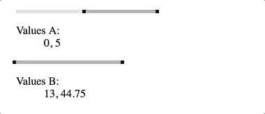

# [elm-range-slider](http://package.elm-lang.org/packages/rkrupinski/elm-range-slider/latest)

A range slider built with Elm.



## Usage

### Install

```shell
elm package install rkrupinski/elm-range-slider
```

### Import

```elm
import Slider.Core as Slider
```

### Initialize

```elm
slider : Slider.Model
slider =
    Slider.init
        { size = Just 200
        , values = Just ( 0.1, 0.9 )
        , step = Just 0.1
        }
```

For the sake of keeping the API as small as possible, the slider only operates on values within `( 0, 1 )` range. If that's not the case with your code, convert the values manually or check what the `Slider.Helpers` module has got for you:


```elm
import Slider.Helpers exposing (..)
```

```elm
slider : Slider.Model
slider =
    Slider.init
        { size = Just 200
        , values = Just ( parseValue 0, parseValue 5 )
        , step = Just <| parseStep 1
        }
```

### Update

Handle updating the slider in your update function:

```elm
case msg of
    SliderMsg sliderMsg ->
        let
            ( slider, cmd ) =
                Slider.update sliderMsg model.slider
        in
            { model | slider = slider } ! [ Cmd.map SliderMsg cmd ]
```

### Render

Render the slider using:

```elm
Html.map SliderMsg <| Slider.view model.slider
```

### Subscriptions

The slider requires subscriptions to work (due to its dependency on the `Mouse` package). Once the slider is initialized, get the required subscriptions using:

```elm
Sub.map SliderMsg <| Slider.subscriptions model.slider
```

### Read values

Read the current values using:

```elm
Slider.getValues model.slider
```

Again, this function returns a tuple of `Float`s within `( 0, 1 )` range. If that doesn't work for you, convert the values based on your range. And of course, the `Slider.Helpers` module has got you covered:

```elm
import Slider.Helpers exposing (..)
```

```elm
renderValues : Slider.Range -> Slider.Values -> Html Msg
renderValues range ( left, right ) =
    let
        formatValue : Float -> String
        formatValue =
            valueFormatter range >> toString

        left_ : String
        left_ =
            formatValue left

        right_ : String
        right_ =
            formatValue right
    in
        text <| left_ ++ ", " ++ right_
```

## Styling

The `Slider.Styles` module contains basic default styles to get you up and running. Use the `Slider.ClassNames` module to generate your custom styles with [elm-css](http://package.elm-lang.org/packages/rtfeldman/elm-css/latest).


## Examples

Check out the [example](example) to see how to make it all work. Additionally, the [example-webpack](example-webpack) directory contains a [webpack](https://webpack.js.org/)-based setup.

